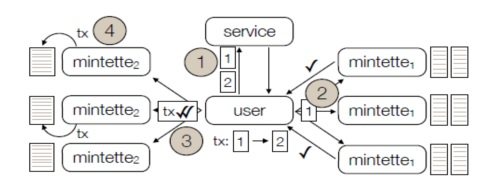
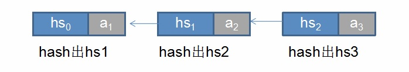
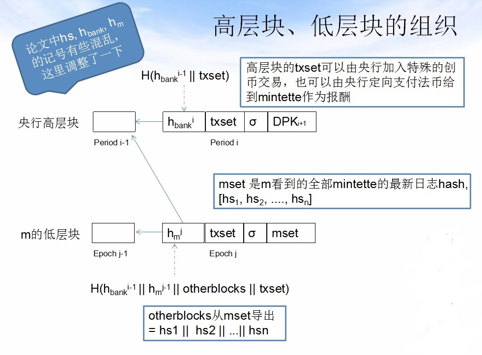

# RSCoin简介
朱立

### 一、RSCoin的背景

RSCoin是英国央行主导的数字货币实验项目，在github上有两个属于该项目的独立代码库，其中一个是python的，已经过时了，最新版本的代码是haskell的，可以在这个地址（ https://github.com/serokell/rscoin ）找到，在此处也可以找到项目的论文。

不同于比特币等准备自下而上发起颠覆的加密货币，RSCoin由英国央行自上而下发起并推动，目的是在充分借鉴加密货币的基础上提升法币的技术性能（特别是转账的吞吐量和时延），维持央行对法币发行的控制力，加强央行对法币流通环节的管控力。

另一方面，作为一种央行领导下的联盟链（或许可链），RSCoin中的验证节点被假设为是和已央行建立良好业务关系的特定金融机构，通常就是指商业银行。由于他们的加入需要得到央行的审核及授权，其在区块链中的行为对其商业伙伴及央行都透明可见，因此可以运用传统的赏罚机制来替代社区加密货币中常用的经济学奖惩算法。

业务的差别导致技术的不同，RSCoin也不能例外。RSCoin虽然受比特币的影响很深，但其技术路线的独到之处也非常明显。本文将快速浏览RSCoin的特别设计。为了表述的清晰，本文在原文容易引起歧义之处对符号进行了微调。

### 二、RSCoin的参与者

RSCoin存在三类不同的参与者：User（客户）、Mintette（矿工）和Bank（特指央行）。“客户”对应于要进行资金转账的普通储户，“矿工”对应于商业银行，且要成为矿工必须得到央行签字授权，“央行”只有一个。每个参与者都拥有自己的私钥、公钥对（sk,pk），公钥可以通过哈希对应到某个“地址”。不同于比特币，这里的私钥、公钥对并不能自行生成，仍将依托现有的某种PKI基础设施在符合KYC规定的前提下实名发放。

在RSCoin中，客户需要承担较多的责任。类似于在银行没有互联互通的年代里所要做的那样，一个客户需要自行从转出行提出现金，携带现金来到转入行并存入资金。由于银行和银行之间完全不需要直接通信，所以不会出现当前央行跨行转账系统的性能瓶颈，也不会出现IBM OBC等区块链系统中因为采用PBFT算法而带来的通信压力。

矿工负责共同审批资金转出转入的请求。“共同”的意思是每一笔资金进出都需经由多个矿工独立审核并出具意见。和比特币不同的是，每一笔资金进出无需经由全部节点验证，只需由有限几个（比如）分管矿工验证就行了。矿工们每过一定时间（称为一个“Epoch, 世代”）会将该世代中的交易打包成一个低层块，并将其串成低层区块链。

央行负责法币创设及矿工激励，也负责对矿工进行授权。央行会以一个较大的周期（称为一个“Peroid, 期间”）搜集合并矿工挖出的各区块，将其整合进一个由高层块构成的区块链中。

### 三、RSCoin的交易结构和共识算法

RSCoin的高性能和高可扩展性完全依赖于其所采用的UTXO模型。但单纯的UTXO模型还不足以保证这些，因为同样基于UTXO模型的比特币性能很差。通过进一步将节点间通信的责任转嫁给User，RSCoin最大程度地发挥了UTXO模型易于并发的优势。

RSCoin采用了比特币的UTXO模型，每笔交易会取用若干utxo并将资金转入若干全新的utxo，包括找零。每个utxo都包含如下四项：{txid, outputid, addr, v)，其中txid是产生该utxo的交易的哈希值，outputid是交易输出序号，addr是接收方地址，v是该笔交易输出金额。{txid, outputid}可以唯一确定一个utxo，称之为utxoid。和比特币不同的是，RSCoin在动用utxo必须显式给出金额，但给出的金额必须和v一致，另外在目前的实现中RSCoin并未采用类比特币脚本。根据utxoid.txid（比如直接取模），可为每个utxo唯一指定一个分区（Sharding），每个分区由若干矿工负责审核。

因为一笔交易的多个输入utxo完全可能具有不同的txid，故可能分归不同分区管辖。因为同一笔交易的多个输出utxo一定具有相同的txid，故一定属于同一分区管辖。

图1 用户为中心的转账
 
图1示意了用户将一笔资金从utxo1转出到utxo2时发生的动作。

步骤1中，用户通过查询Service确知utxo1和utxo2的主管分区目前所属矿工是谁；步骤2中用户联络utxo1的分管矿工并得到足够的转出许可签名（转出许可阶段）；步骤3中用户将uxto1的转出许可签名递交给utxo2的分管矿工，后者审核转出许可签名有效后认可交易并向用户发送回执（转入确认阶段），在稍后的步骤4中utxo2的主管矿工会各自将该笔交易记入自己的区块链中。如果上例中转出utxo分属多个分区，则用户需要从多个分区各自获取足够的转出许可签名后一并提交转入分区审批处理。

在转出许可阶段矿工会对资金余额进行总量检查，确保转出资金总量大于等于转入资金总量。由于同一交易的输入utxo可能分属不同分区，分区之间也没有直接通信，所以矿工应对自身了解的utxo值进行检查，再根据交易涉及的各utxo的v分量总和进行检查，此时并不需要确保其他分区名下的utxo值正确。

在转入确认阶段，除了上述总量检查之外，矿工还必须检查每一个输入utxo都获得了足够多的确认签名。由于utxo彼此独立，只要每个输入utxo都单独获得了足够多的确认，资金总量又符合要求，就可以安全地进行入账动作。

目前RSCoin实验代码要求转出许可及转入确认阶段都需要相关分区的全部矿工一致同意，但这个要求未免过于严苛。若每个分区有5个矿工，5个矿工中最多有1个拜占庭节点，则转出转入阶段可以最多只能要求用户成功联络到各4个矿工，两套各4个矿工最坏情况下也有3个重合。即使重合部分中有1个拜占庭节点，剩下2个依然可以排除干扰证明用户确实之前转入了那个utxo，从而允许用户转出资金。

根据本算法，同一分区的不同矿工之间可以永远也没有一样的utxo列表，但资金业务运作仍然是准确的。在此意义上说，RSCoin实现了一种非常特别的共识算法。

### 四、RSCoin中的区块和链

每个矿工会维护一个动作日志，日志中至少可以包含三类不同的动作。Query动作发生在资金转出时，日志中会记录相关交易；Update动作发生在资金转入时，日志中会记录交易及全部转出审核证明（称为bundle）；CloseEpoch动作发生在Epoch结束时，日志中将记录该矿工所了解的其他全部矿工（可能属于其他分区）的最新动作日志摘要，之后矿工会将该Epoch的全部交易打包成一个低层块。

“动作日志摘要”通过增量哈希构造，定义如下：若将第i个动作记作ai, 则从创世起包含至ai为止的动作日志摘要hsi 就是 Hash(hsi-1 ||ai)，其中‘||’表示前后拼接。很明显这类似于比特币区块中的prevHash。

图2 动作日志的类区块链结构

动作日志还不是矿工最终生成的低层区块链。矿工在完成Update和Query动作时，会将其最新的动作日志摘要值一并给到用户，并通过用户间接地给到其他矿工。因此前文提到在CloseEpoch动作时矿工有能力在日志中写入其所了解的全部其他矿工的最新动作日志摘要。动作日志摘要的这种用法实质上是一种基于哈希的向量时钟。

图3 央行高层块和矿工低层块的组织

RSCcoin采用了一种双层区块链结构，底下是每个矿工独立维护的多条低层链，出块间隔（Epoch周期）较短；其上是央行负责维护的高层链，出块间隔（Peroid周期）通常比低层链大至少一个数量级。

低层块除了通过哈希指针指向自身前驱之外，还通过哈希指针指向前一个Peroid的高层块，因此两层链并不独立。
央行高层块的交易列表包含了该Peroid中全部低层块的合法交易，同时央行有权在高层块的交易列表中增加法币发行记录，也可以向矿工发放法币作为工作激励。另一方面，央行也有权通过DPK区域规定下一个Peroid中哪些矿工的公钥有效，实现对矿工的授权管理。

### 五、RSCoin总结

RSCoin充分利用UTXO模型的并发优势，借助用户作为节点间消息通道，在PoW等公有链算法和传统BFT算法之外另辟蹊径，实现了一个高吞吐量、高可扩展性的、拜占庭容错的数字法币支付系统原型，其思想颇有值得借鉴之处。

RSCoin的当前版本也存在一些不足，最大问题是没有明确客户是否必须成功访问分区中的全部矿工才能推进算法。虽经分析修改后的算法可以只要求大部分矿工正常运作，但RSCoin自然也未就“大部分”是多少给出标准。这一不足还带来另一问题，也就是央行节点应该如何合并不同矿工的低层块。在目前RSCoin的实现中，央行节点只是简单汇总低层块就可以了，如果考虑到拜占庭节点的存在，央行节点很可能需要做更多的工作才能确保高层块的交易记录是一致的、易用的。
